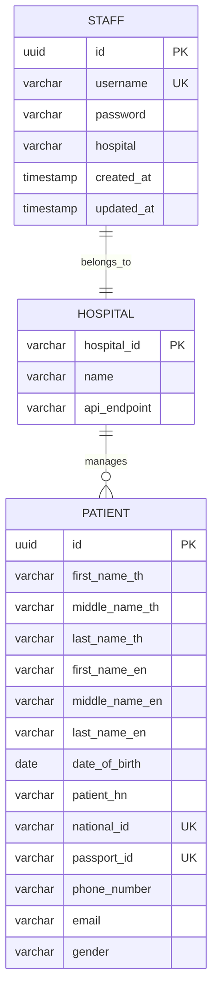

# Entity Relationship Diagram

## Database Schema Overview

The Agnos Hospital Middleware system uses PostgreSQL with two main entities: **Staff** and **Patient**.

## Entities

### 1. Staff Entity (`tbl_staff`)

**Purpose**: Stores hospital staff information and authentication credentials.

| Column | Type | Constraints | Description |
|--------|------|-------------|-------------|
| id | UUID | PRIMARY KEY | Unique identifier for staff member |
| username | VARCHAR | UNIQUE, NOT NULL | Login username |
| password | VARCHAR | NOT NULL | Hashed password (bcrypt) |
| hospital | VARCHAR | NOT NULL | Hospital identifier |
| created_at | TIMESTAMP | | Record creation timestamp |
| updated_at | TIMESTAMP | | Record last update timestamp |

**Indexes**:
- Primary key on `id`
- Unique index on `username`
- Composite index on `(username, hospital)` for login queries

### 2. Patient Entity (`tbl_patients`)

**Purpose**: Stores patient information from various hospitals.

| Column | Type | Constraints | Description |
|--------|------|-------------|-------------|
| id | UUID | PRIMARY KEY | Unique identifier for patient |
| first_name_th | VARCHAR | | First name in Thai |
| middle_name_th | VARCHAR | | Middle name in Thai |
| last_name_th | VARCHAR | | Last name in Thai |
| first_name_en | VARCHAR | | First name in English |
| middle_name_en | VARCHAR | | Middle name in English |
| last_name_en | VARCHAR | | Last name in English |
| date_of_birth | DATE | | Patient's date of birth |
| patient_hn | VARCHAR | | Hospital Number |
| national_id | VARCHAR | UNIQUE | Thai National ID |
| passport_id | VARCHAR | UNIQUE | Passport ID |
| phone_number | VARCHAR | | Contact phone number |
| email | VARCHAR | | Email address |
| gender | VARCHAR | | Gender (M/F) |

**Indexes**:
- Primary key on `id`
- Unique index on `national_id`
- Unique index on `passport_id`
- Index on `patient_hn` for hospital queries
- Composite index on `(first_name_th, last_name_th)` for name searches
- Composite index on `(first_name_en, last_name_en)` for English name searches

## Relationships

### Current Relationships
Currently, there is **no direct foreign key relationship** between Staff and Patient entities. This design choice supports:

1. **Hospital Isolation**: Staff can only access patients from their hospital (enforced at application level)
2. **Flexibility**: Patients can be associated with multiple hospitals
3. **External API Integration**: Patient data can come from external sources

### Logical Relationships

```
Staff -----> Hospital -----> Patients
  |            (logical)        |
  |                            |
  +-- username + hospital -----+
      (used for authorization)
```

**Business Rules**:
- One staff member belongs to one hospital
- Staff can only search patients from their assigned hospital
- Patients are not directly linked to staff in the database
- Hospital association is managed through business logic

## ER Diagram (Mermaid)



## Database Constraints

### Staff Table Constraints
```sql
-- Primary key
ALTER TABLE tbl_staff ADD CONSTRAINT pk_staff PRIMARY KEY (id);

-- Unique username
ALTER TABLE tbl_staff ADD CONSTRAINT uk_staff_username UNIQUE (username);

-- Not null constraints
ALTER TABLE tbl_staff ALTER COLUMN username SET NOT NULL;
ALTER TABLE tbl_staff ALTER COLUMN password SET NOT NULL;
ALTER TABLE tbl_staff ALTER COLUMN hospital SET NOT NULL;

-- Check constraint for hospital values
ALTER TABLE tbl_staff ADD CONSTRAINT chk_staff_hospital 
    CHECK (hospital IN ('hospital-a', 'hospital-b', 'hospital-c'));
```

### Patient Table Constraints
```sql
-- Primary key
ALTER TABLE tbl_patients ADD CONSTRAINT pk_patient PRIMARY KEY (id);

-- Unique constraints
ALTER TABLE tbl_patients ADD CONSTRAINT uk_patient_national_id UNIQUE (national_id);
ALTER TABLE tbl_patients ADD CONSTRAINT uk_patient_passport_id UNIQUE (passport_id);

-- Check constraint for gender
ALTER TABLE tbl_patients ADD CONSTRAINT chk_patient_gender 
    CHECK (gender IN ('M', 'F'));

-- Check constraint for date of birth
ALTER TABLE tbl_patients ADD CONSTRAINT chk_patient_dob 
    CHECK (date_of_birth <= CURRENT_DATE);
```

## Indexes for Performance

### Staff Table Indexes
```sql
-- Composite index for login queries
CREATE INDEX idx_staff_username_hospital ON tbl_staff (username, hospital);

-- Index for hospital-based queries
CREATE INDEX idx_staff_hospital ON tbl_staff (hospital);
```

### Patient Table Indexes
```sql
-- Search optimization indexes
CREATE INDEX idx_patient_national_id ON tbl_patients (national_id);
CREATE INDEX idx_patient_passport_id ON tbl_patients (passport_id);
CREATE INDEX idx_patient_hn ON tbl_patients (patient_hn);

-- Name search indexes
CREATE INDEX idx_patient_name_th ON tbl_patients (first_name_th, last_name_th);
CREATE INDEX idx_patient_name_en ON tbl_patients (first_name_en, last_name_en);

-- Contact information indexes
CREATE INDEX idx_patient_phone ON tbl_patients (phone_number);
CREATE INDEX idx_patient_email ON tbl_patients (email);

-- Date-based queries
CREATE INDEX idx_patient_dob ON tbl_patients (date_of_birth);
```

## Data Flow

### Staff Authentication Flow
1. Staff provides username, password, and hospital
2. System queries `tbl_staff` with composite key `(username, hospital)`
3. Password verification using bcrypt
4. JWT token generated with staff details

### Patient Search Flow
1. Authenticated staff submits search criteria
2. System extracts hospital from JWT token
3. Search local `tbl_patients` table
4. If no results and searching by ID, query external Hospital API
5. Cache external results in local database
6. Return filtered results based on staff's hospital

## Future Enhancements

### Potential Schema Extensions

1. **Hospital Table**: Explicit hospital entity
```sql
CREATE TABLE tbl_hospitals (
    id VARCHAR PRIMARY KEY,
    name VARCHAR NOT NULL,
    api_endpoint VARCHAR,
    api_key VARCHAR,
    created_at TIMESTAMP DEFAULT NOW()
);
```

2. **Patient-Hospital Association**: Many-to-many relationship
```sql
CREATE TABLE tbl_patient_hospitals (
    patient_id UUID REFERENCES tbl_patients(id),
    hospital_id VARCHAR REFERENCES tbl_hospitals(id),
    patient_hn VARCHAR,
    created_at TIMESTAMP DEFAULT NOW(),
    PRIMARY KEY (patient_id, hospital_id)
);
```

3. **Audit Trail**: Track data access
```sql
CREATE TABLE tbl_audit_log (
    id UUID PRIMARY KEY DEFAULT gen_random_uuid(),
    staff_id UUID REFERENCES tbl_staff(id),
    action VARCHAR NOT NULL,
    resource_type VARCHAR NOT NULL,
    resource_id UUID,
    timestamp TIMESTAMP DEFAULT NOW(),
    ip_address INET
);
```

## Security Considerations

### Data Protection
- Passwords stored as bcrypt hashes (cost factor 12)
- UUIDs used as primary keys to prevent enumeration
- No sensitive data in indexes
- Unique constraints prevent duplicate identities

### Access Control
- Hospital-based data isolation
- No direct foreign keys allow flexible access patterns
- Application-level authorization enforcement
- JWT tokens contain hospital context

### Compliance
- Schema supports GDPR/PDPA requirements
- Audit trail capability for data access tracking
- Soft delete capability can be added for data retention
